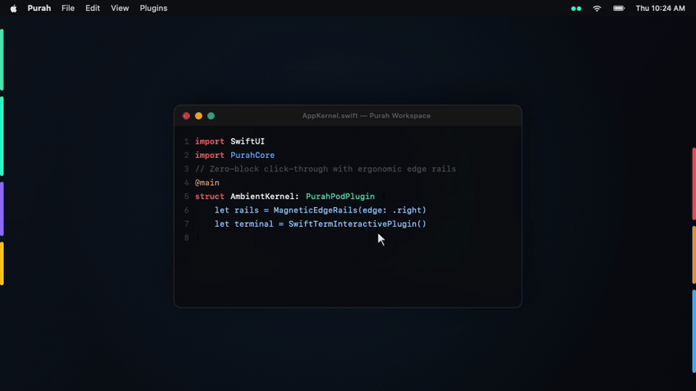

<div align="center">

<picture>
  <source media="(prefers-color-scheme: dark)" srcset="assets/Purah-icon-macOS-1024.png">
  
</picture>

# Purah
### macOS Magnetic Edge Rails & Ambient Ergonomic Kernel

[](https://swift.org)
[](https://apple.com/macos)
[](https://developer.apple.com/metal/)
[](https://github.com)
[](LICENSE)

<br />

English &nbsp;|&nbsp; [**简体中文 (Chinese)**](README_CN.md)

<br />

<!-- ═════════════════════ DEMO SHOWCASE ═════════════════════ -->
<p align="center">
  
</p>
<!-- ═══════════════════════════════════════════════════════════ -->

</div>

---

<br />

### 💡 What is Purah?

**Purah** is an ultra-lightweight ambient desktop companion for macOS. Sitting silently as non-intrusive ambient strips along the physical borders of your screen, Purah activates when your cursor glides to the display bezel—springing interactive cards inward toward the center with physical, co-planar fluidity.

It runs quietly in the background without stealing focus or cluttering your Dock, guaranteeing **100% click-through pass-through** to underlying apps and code editors.

---

### ✨ Key Features

- **⚡️ Zero-Block Click-Through**: Transparent empty space lets clicks pass straight through to desktop windows, Finder, and IDEs without blocking your workflow.
- **🎛 Physical Bezel Extrusion**: Drawers slide smoothly out from the screen edge towards the center and retract solidly with zero ghosting.
- **💻 Edge Interactive Terminal**: Persistent background terminal shell powered by [SwiftTerm](https://github.com/migueldeicaza/SwiftTerm) with full VT100/Xterm emulation, live font scaling, and Starship / Nerd Font glyphs.
- **📐 Ergonomic Zone Layout**: Intelligently arranges modules into glance, action, and flick zones based on natural cursor momentum.
- **🌊 60 / 120 FPS Fluid Waveform**: Metal GPU-driven audio visualizer that pulses naturally along the screen edge.
- **🖥 Multi-Display Adaptive**: Follows your cursor across displays while suppressing accidental triggers when crossing screen borders.

---

### 🧩 Built-in Plugins

| Plugin | Icon | Description |
| :--- | :---: | :--- |
| **Terminal** | `apple.terminal.fill` | Persistent background command shell powered by [SwiftTerm](https://github.com/migueldeicaza/SwiftTerm) with Starship & Nerd Font support. |
| **Hardware Vitals** | `waveform.path.ecg` | Real-time CPU, RAM, GPU, SSD, thermal, and network telemetry. |
| **Calendar Timeline** | `calendar` | Day agenda timeline with meeting link detection (`Zoom`, `Meet`, `Teams`). |
| **Todo Checklist** | `checklist` | System Reminders integration with one-tap completion. |
| **Music Waveform** | `waveform` | Apple Music playback controller with dynamic visualizer. |
| **Drop Shelf** | `tray.fill` | Temporary desktop shelf for drag-and-drop file staging. |
| **Quick Notes** | `note.text` | Instant scratchpad for fleeting thoughts and code snippets. |
| **Script Runway** | `terminal.fill` | Quick-fire developer automation runway for everyday maintenance tasks. |

> 🚀 **More to come**: Additional plugins, custom widgets, and third-party developer extensibility are actively in development.

---

### ⌨️ Shortcut & Ergonomic Interactions

Purah is designed to stay completely out of your way until intentionally summoned.

#### The Only Shortcut
- **`⌥⇥` (Option + Tab)**: Instant **Freeze / Unfreeze** rails toggle with a tactile HUD. Use it anytime during full-screen presentations or focused coding sessions.

#### Anti-Accidental Touch & Anti-Loss Details
- **Edge Summon**: Slide your cursor to the 14px physical screen bezel to pop out the corresponding drawer.
- **Swipe Rejection**: Rapid flings across screen edges or moving between displays are ignored to prevent accidental popups.
- **Resistance Breakthrough**: Pushing deliberately against the outer bezel immediately opens the drawer with 0ms delay.
- **Exit Grace Window**: A brief 150ms buffer prevents drawers from collapsing if your cursor momentarily slips off while reaching for corner buttons.
- **Catch Corridor**: An invisible catch buffer extends past the card edge, ensuring drawers stay open even during fast cursor movements.

---

### 🛠 Building & Verification

```bash
# Clone the repository
git clone https://github.com/rheatin/Purah.git
cd Purah

# Run test suite
swift test --disable-sandbox

# Build release binary
swift build -c release --disable-sandbox

# Launch the app
.build/release/PurahApp
```

---

### 🙏 Acknowledgments

- **[SwiftTerm](https://github.com/migueldeicaza/SwiftTerm)** by Miguel de Icaza — powering Purah's GPU-accelerated edge terminal emulation.
- **[MacToastKit](https://github.com/daniyalmaster693/MacToastKit)** by daniyalmaster693 — inspiration and implementation reference for minimal, non-intrusive macOS HUD toasts.

---

### 📄 License

Project Purah is licensed under the [MIT License](LICENSE).

<div align="center">
<sub>Crafted with ergonomic obsession for macOS power users. Inspired by the Purah Pad concept.</sub>
</div>
